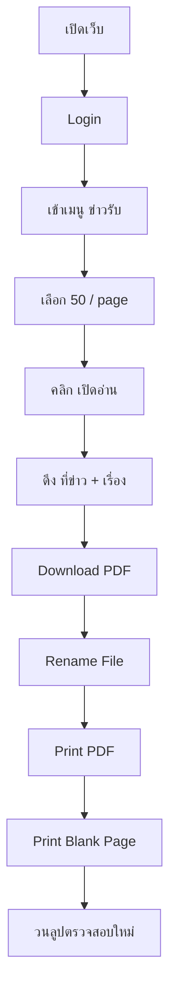

# 📰 Auto News Receiver & PDF Printer Bot

> 🤖 ระบบอัตโนมัติสำหรับตรวจสอบ “ข่าวรับ” จาก Web ภายในองค์กร  
> 📥 ดาวน์โหลดไฟล์แนบ  
> 🖨️ สั่งพิมพ์ PDF อัตโนมัติผ่าน Adobe Acrobat  
> 📂 จัดเก็บไฟล์ตามวันที่ (พ.ศ.)

---

## 🚀 Overview

โปรเจกต์นี้เป็น Python Automation Script ที่ใช้ **Playwright + Windows API + Adobe Acrobat** เพื่อทำงานดังนี้:

1. เปิดเว็บภายในองค์กร
2. Login อัตโนมัติ
3. ตรวจสอบเมนู “ข่าวรับ”
4. คลิก “เปิดอ่าน”
5. ดึงข้อมูล:
   - ที่ข่าว
   - เรื่อง
6. ดาวน์โหลดไฟล์แนบ
7. เปลี่ยนชื่อไฟล์ตามข้อมูลข่าว
8. สั่งพิมพ์ PDF อัตโนมัติ
9. พิมพ์หน้าว่างปิดท้าย
10. วนลูปเช็คข่าวใหม่ทุก 30 นาที

---

## 🧠 Tech Stack

- 🐍 Python
- 🎭 Playwright (Chromium + Chrome Channel)
- 🖨️ Adobe Acrobat DC (Command Line Print)
- 🪟 Win32 API (pywin32)
- 📄 ReportLab

---

## ⚙️ Workflow การทำงาน



---

## 📁 การตั้งชื่อโฟลเดอร์อัตโนมัติ

ระบบจะสร้างโฟลเดอร์ตามวันที่ปัจจุบัน (ปี พ.ศ.)

ตัวอย่าง:

```
14.2.69
```

โครงสร้างจริง:

```
C:\Users\User\Downloads\14.2.69\
```

---

## 🔐 ระบบ Retry & Protection

### Retry เปิดเว็บสูงสุด 5 ครั้ง

```python
MAX_RETRY = 5
WAIT_BETWEEN = 10
GOTO_TIMEOUT = 30_000
```

### Timeout Protection

```python
MAX_WAIT = 180  # 3 นาที
```

### ป้องกัน Chrome ถูกปิดระหว่างรัน

```python
page.evaluate("() => document.title")
```

---

## 📥 การ Download ไฟล์

ระบบจะ:

1. รอ `expect_download()`
2. ทำความสะอาดชื่อไฟล์ (ลบอักขระต้องห้าม)
3. ตั้งชื่อไฟล์ใหม่เป็น:

```
{ที่ข่าว}{เรื่อง}.pdf
```

---

## 🖨️ ระบบพิมพ์เอกสาร

ใช้ Adobe Acrobat แบบ command line:

```python
cmd = [ADOBE, "/t", pdf_path]
```

หลังพิมพ์เอกสารจริง จะ:

- สร้าง blank page PDF ด้วย ReportLab
- พิมพ์หน้าว่าง 1 หน้า
- ใช้สำหรับแยกชุดเอกสาร

---

## 🧩 ฟังก์ชันสำคัญ

### 🔎 get_text_any_frame()

ดึงข้อความจาก element ไม่ว่าจะอยู่ใน:

- main page
- iframe

```python
def get_text_any_frame(page, selector, timeout=20000):
```

---

### 🔒 lock_user_input()

สร้าง overlay ป้องกันผู้ใช้คลิกขณะ automation ทำงาน

---

### 🔓 unlock_user_input()

คืนสิทธิ์การควบคุมให้ผู้ใช้หลัง script จบ

---

### 🖨️ print_pdf_adobe()

เรียก Adobe Acrobat เพื่อสั่งพิมพ์ไฟล์ PDF

---

## 🛠️ Installation

### 1️⃣ ติดตั้ง Python Packages

```bash
pip install playwright reportlab pywin32
```

### 2️⃣ ติดตั้ง Playwright Browser

```bash
playwright install
```

### 3️⃣ ตั้งค่า Path Adobe Acrobat

```python
ADOBE = r"C:\Program Files\Adobe\Acrobat DC\Acrobat\Acrobat.exe"
```

---

## 🖥️ Environment Requirement

- Windows OS
- Google Chrome
- Adobe Acrobat DC
- สิทธิ์เข้าถึงเว็บภายในองค์กร

---

## 🔄 Loop Logic

ระบบจะทำงานแบบวนลูป:

- เช็คข่าวใหม่
- หากไม่พบ → รอ 30 นาที
- Refresh หน้า
- Login ใหม่
- ทำงานต่อเนื่อง

---

## 🧯 Error Handling

รองรับกรณี:

- โหลดเว็บไม่สำเร็จ
- Timeout
- Chrome ถูกปิด
- Download ไม่สำเร็จ
- ไม่พบ element
- พิมพ์ไม่สำเร็จ

---

## ⚠️ ข้อควรระวัง

- ปัจจุบันมีการ hardcode Username/Password (ควรย้ายไป .env)
- ทำงานแบบ infinite loop
- ใช้เฉพาะ Windows เท่านั้น
- ต้องเปิด Chrome แบบ non-headless

---

## 🧹 การปิดโปรแกรม

- กด `Ctrl + C`
- หรือปิด Chrome → script จะหยุดเอง

---

## 📌 Future Improvement

- ใช้ `.env` เก็บ Credential
- บันทึก log ลงไฟล์
- แจ้งเตือนผ่าน LINE
- ทำ headless mode
- เชื่อมต่อฐานข้อมูลเก็บประวัติข่าว

---

## 👨‍💻 Author

Automation Script สำหรับงานเอกสารภายในองค์กร  
Designed for stability & unattended execution

---

⭐ หากโปรเจกต์นี้ช่วยคุณได้ อย่าลืมกด Star ให้ repo นี้ด้วยนะครับ 😉
